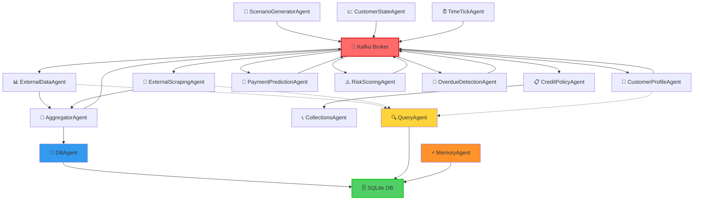
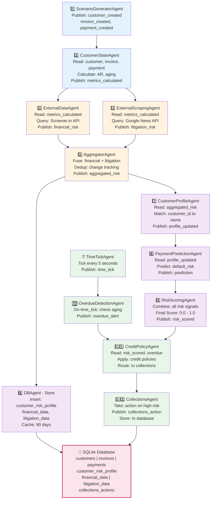
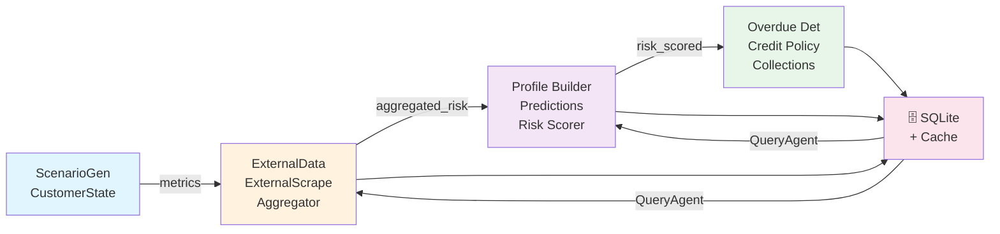
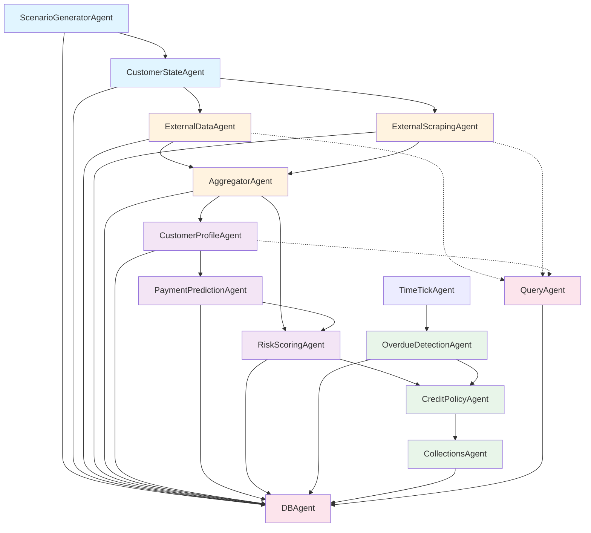
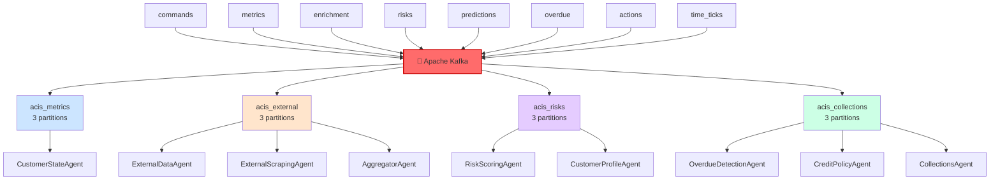
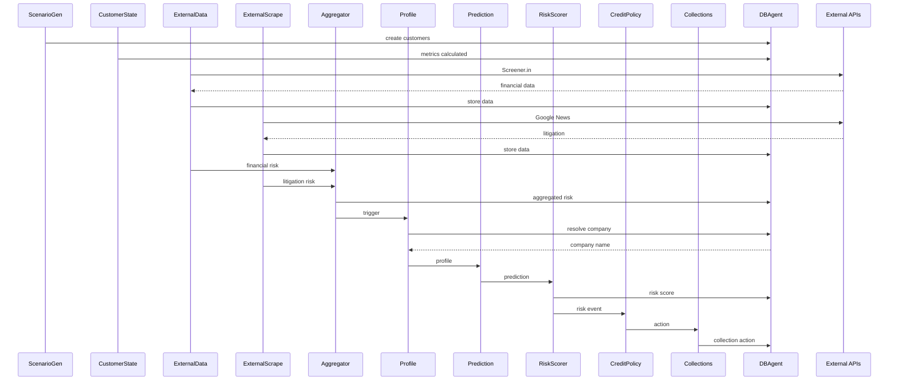
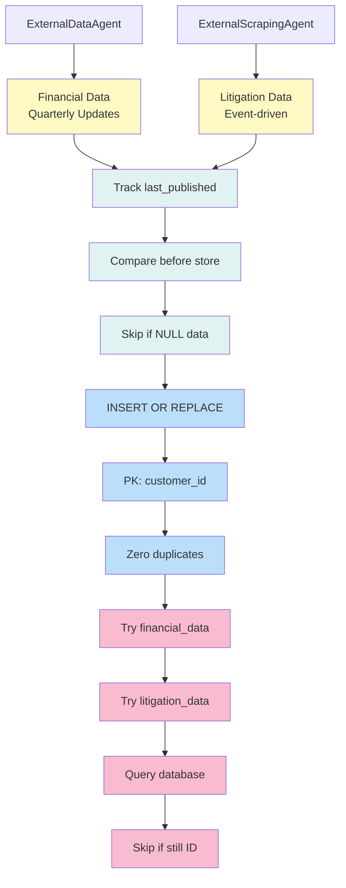

# ACIS-X Architecture (Mermaid)

## Compressed System Architecture

---

## Complete Data Flow (Mermaid)

---

## Compact Topic Flow

---

## Agent Dependency Matrix

---

## Event Stream Architecture

---

## Request-Response with Persistence

---

## Data Consistency & Caching Strategy

